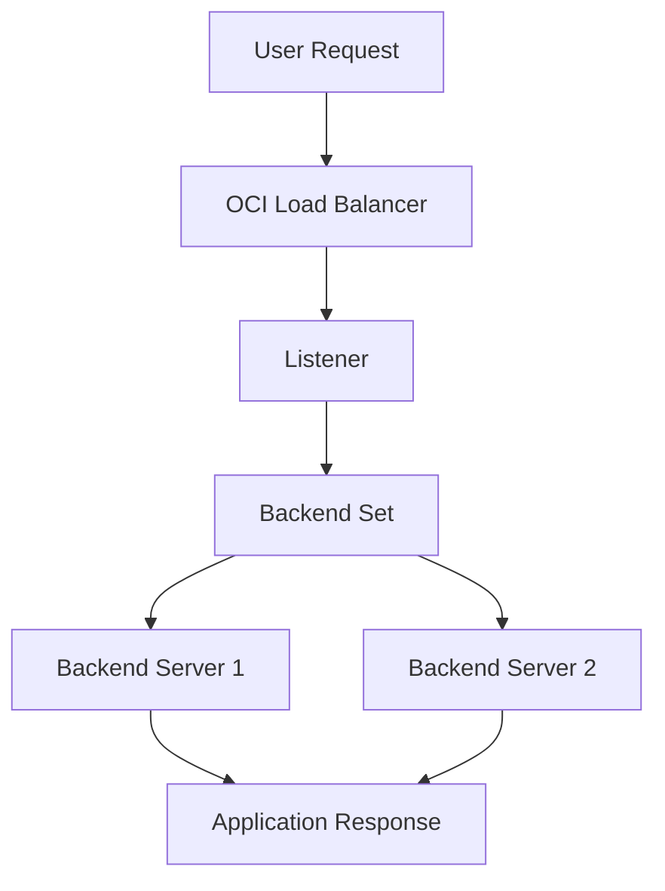
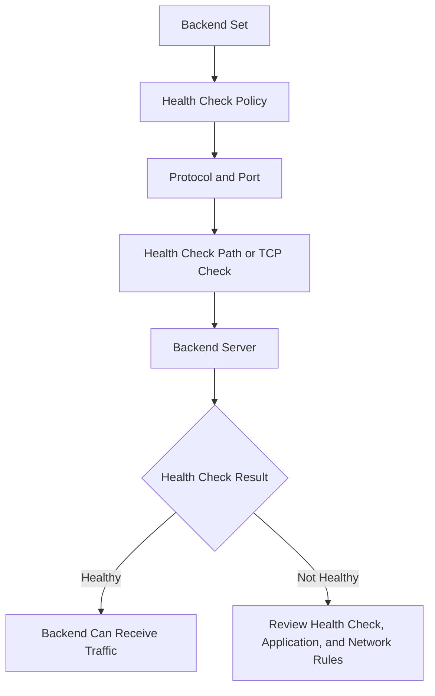

# OCI Load Balancer Backend Health Check Validation

## Overview

This repository explains a simple OCI Load Balancer backend health check and validation flow.

It covers how a load balancer receives traffic, how a listener forwards the request, how a backend set routes traffic to backend servers, and how health checks help decide whether a backend should receive traffic.

The focus is simple:

- Review load balancer components
- Check listener and backend set flow
- Review backend health check settings
- Check backend health status
- Review the network rule dependency
- Use sample CLI commands for validation
- Review expected results and common issues

No confidential information, tenancy details, OCIDs, real backend IPs, real application URLs, real DNS names, or project-specific information is included.

---

## Why I Created This

A load balancer is useful only when traffic can reach healthy backend servers.

Creating the load balancer is one part. The important part is checking whether the listener, backend set, backend server, health check, and network rules are aligned.

This repository keeps that flow simple and practical.

---

## Product Used

Oracle Cloud Infrastructure Load Balancer

---

## Load Balancer Routing Flow



---

## Backend Health Check Flow



---

## Components Covered

This repository covers the following OCI Load Balancer areas:

- Load Balancer
- Listener
- Backend set
- Backend server
- Load balancing policy
- Health check policy
- HTTP health check
- TCP health check
- Backend health status
- Backend set health status
- Load balancer health status
- Network security rule review
- CLI validation commands
- Expected results
- Troubleshooting review

---

## Repository Contents

```text
architecture/
  load-balancer-routing-flow.md
  backend-health-check-flow.md

docs/
  load-balancer-components.md
  listener-and-routing.md
  backend-set-and-health-check.md
  security-rule-review.md
  product-usage-summary.md

validation/
  console-review-checklist.md
  sample-cli-commands.md
  expected-results.md

troubleshooting/
  backend-health-not-ok-review.md
```

---

## What I Understood

My main understanding is that a load balancer should not be reviewed only from the front-end endpoint.

The full path should be checked:

```text
User request -> Load Balancer -> Listener -> Backend Set -> Backend Server -> Application Response
```

A backend can be attached to a backend set, but it should receive traffic only when the health check and network path are correct.

If backend health is not OK, the review should not stop at the server. The health check protocol, port, path, backend application, and network rules should also be checked.

---

## Safe Usage Note

This repository uses sample names, placeholders, sample commands, and simple diagrams only.

It does not include copied diagrams, screenshots, tenancy details, OCIDs, real backend IPs, real public IPs, real DNS names, real application URLs, real health check paths, or project-specific information.
