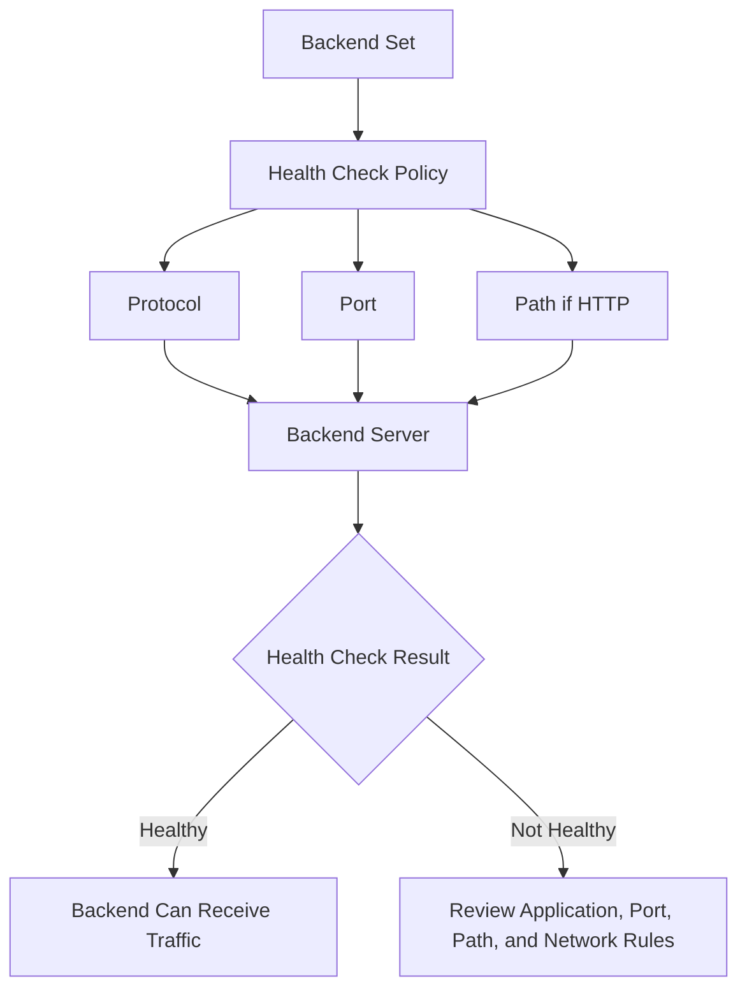

# Backend Health Check Flow

This diagram shows a simple backend health check flow.

The health check helps confirm whether a backend server is available.

If the backend passes the health check, it can receive traffic.

If the backend does not pass the health check, the backend health should be reviewed before depending on the load balancer flow.

---

## What I Understood

My main understanding is that backend health is not only a server issue.

The health result depends on the health check protocol, port, path, application response, and network access between the load balancer and backend server.
