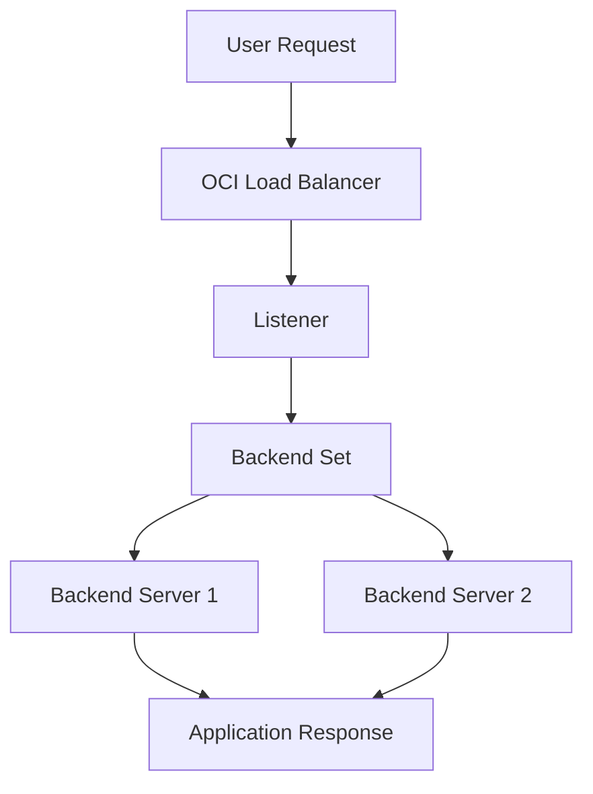

# Load Balancer Routing Flow

This diagram shows a simple OCI Load Balancer routing flow.

The load balancer receives the request through a listener.

The listener forwards the request to the configured backend set.

The backend set sends traffic to backend servers based on the load balancing policy and backend health status.

---

## What I Understood

My main understanding is that the load balancer flow has to be reviewed end to end.

The listener can be correct, but traffic can still fail if the backend set, backend server, health check, or network rules are not aligned.
