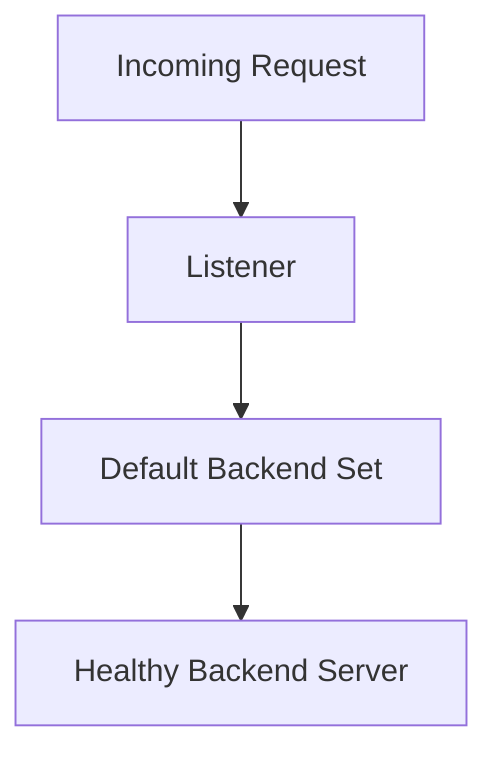

# Listener and Routing

## Overview

A listener receives incoming traffic on the load balancer.

The listener uses a protocol and port, and then forwards traffic to a backend set.

---

## Listener Review

When reviewing a listener, these items should be checked:

- Listener name
- Protocol
- Port
- Default backend set
- Whether the listener matches the application access requirement
- Whether the backend set is healthy

---

## Example Listener

```text
Protocol: HTTP
Port: 80
Default backend set: demo_backend_set
```

This is only a sample.

The actual protocol and port should match the application design.

---

## Routing Flow



---

## Why Listener Review Matters

A listener can be created correctly, but traffic can still fail if the default backend set is not healthy.

The listener and backend set should be reviewed together.

---

## What I Understood

My main understanding is that listener review should not stop at protocol and port.

The listener must point to the correct backend set, and the backend set must have healthy backend servers.
