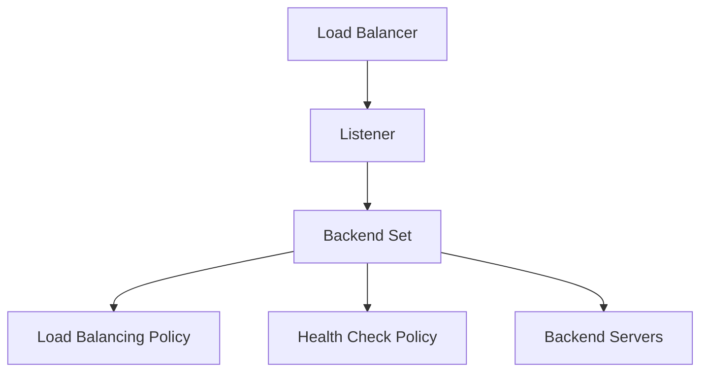

# Load Balancer Components

## Overview

OCI Load Balancer helps distribute incoming traffic to backend servers.

A basic load balancer setup includes:

- Load balancer
- Listener
- Backend set
- Backend servers
- Health check policy
- Load balancing policy

---

## Load Balancer

The load balancer is the entry point for incoming traffic.

It receives the request and passes it through a listener.

---

## Listener

A listener checks for incoming traffic on a specific protocol and port.

Example:

```text
Protocol: HTTP
Port: 80
```

The listener forwards traffic to a backend set.

---

## Backend Set

A backend set is a group of backend servers with a load balancing policy and health check policy.

The backend set connects listener traffic to backend servers.

---

## Backend Server

A backend server is the compute instance or server that receives traffic from the load balancer.

A backend server usually has an IP address and port.

Sample format:

```text
<backend_private_ip>:<backend_port>
```

Real backend IPs should not be published in GitHub.

---

## Health Check Policy

The health check policy checks whether backend servers are available.

The check can be based on TCP or HTTP, depending on the backend setup.

---

## Simple Component Flow



---

## What I Understood

My main understanding is that each load balancer component has a specific role.

The listener receives traffic. The backend set organizes backend servers. The health check confirms backend availability. The load balancing policy helps decide how traffic is distributed.
