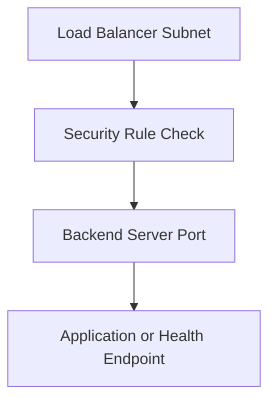

# Security Rule Review

## Overview

Network security rules can affect whether the load balancer can reach backend servers.

Even if the load balancer, listener, and backend set are configured, traffic can fail if the required network path is blocked.

---

## What Should Be Reviewed

The review should include:

- Load balancer subnet
- Backend server subnet
- Backend server port
- Health check port
- Security list rules
- Network Security Group rules, if used
- Application listener on the backend server
- Route table and subnet alignment, if needed

---

## Simple Flow



---

## Sample Rule Review

```text
Source: Load balancer subnet or allowed source
Destination: Backend server private IP
Port: Backend application or health check port
Protocol: TCP
```

This is a sample review format only.

No real subnet, IP address, or security rule value should be published.

---

## Common Issues

Traffic can fail when:

- Backend port is not allowed
- Health check port is blocked
- Wrong protocol is used
- Backend application is not listening
- NSG and security list rules are not aligned
- Route table or subnet setup is not correct

---

## What I Understood

My main understanding is that health check failure is not always caused by the application.

Network security rules can also cause the backend to show unhealthy.

That is why the backend health check and security rule review should be done together.
