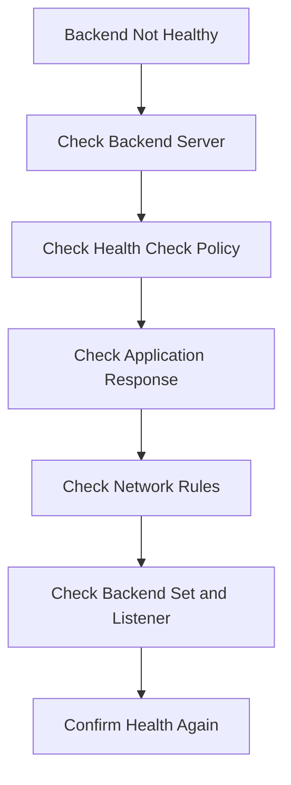

# Backend Health Not OK Review

## Overview

This file lists review points when an OCI Load Balancer backend does not show healthy status.

The goal is to check the issue step by step instead of assuming the server is the only problem.

---

## Step 1 - Check Backend Server

Review:

- Is the backend server running?
- Is the backend server in the expected subnet?
- Is the application running?
- Is the application listening on the expected port?

---

## Step 2 - Check Health Check Policy

Review:

- Is the health check protocol correct?
- Is the health check port correct?
- Is the health check path correct, if HTTP is used?
- Is the timeout value reasonable?
- Is the interval value reasonable?

---

## Step 3 - Check Application Response

Review:

- Does the application return the expected response?
- Does the health endpoint exist?
- Is the backend returning an error code?
- Is the application redirecting the health check unexpectedly?

---

## Step 4 - Check Network Rules

Review:

- Does the backend security list allow the required port?
- Does the backend NSG allow traffic from the load balancer path?
- Is the health check port allowed?
- Are route rules and subnet setup aligned?

---

## Step 5 - Check Backend Set

Review:

- Is the backend server attached to the correct backend set?
- Is the backend set selected by the listener?
- Is the backend port correct?
- Is the backend set health status showing an issue?

---

## Simple Review Flow

---

## What I Understood

My main understanding is that unhealthy backend status should be reviewed as a full path issue.

The issue can be in the server, application, health check policy, backend port, listener mapping, or network rules.
